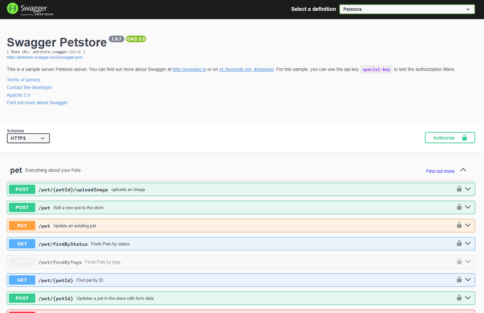

# amaya-swagger [](https://repo1.maven.org/maven2/io/github/amayaframework/amaya-swagger)

The amaya framework module that implements the standalone swagger SPA.

## Getting Started

To install it, you will need:

* Java 11+
* Maven/Gradle
* Amaya Core or set of core modules

### Features

* Providing a swagger-ui with all static files
* Providing swagger manifests as static
* Configurable static root of swagger-ui and other

## Installing

### Gradle dependency

```Groovy
dependencies {
    implementation group: 'io.github.amayaframework', name: 'amaya-core', version: '2.0.2'
    implementation group: 'io.github.amayaframework', name: 'amaya-swagger', version: '1.0.0'
    // Optional dependency for swagger-ui impl
    implementation group: 'io.github.amayaframework', name: 'swagger-ui-bundle', version: '1.0.4'
}
```

### Maven dependency

```
<dependency>
    <groupId>io.github.amayaframework</groupId>
    <artifactId>amaya-core</artifactId>
    <version>2.0.2</version>
</dependency>
<dependency>
    <groupId>io.github.amayaframework</groupId>
    <artifactId>amaya-swagger</artifactId>
    <version>1.0.0</version>
</dependency>
<!--Optional dependency for swagger-ui impl-->
<dependency>
    <groupId>io.github.amayaframework</groupId>
    <artifactId>swagger-ui-bundle</artifactId>
    <version>1.0.4</version>
</dependency>
```

## Examples

### Petstore

```Java
import io.github.amayaframework.core.WebBuilders;
import io.github.amayaframework.jetty.JettyServerFactory;
import io.github.amayaframework.swagger.SwaggerConfigurers;
import io.github.amayaframework.swagger.Documents;
import io.github.amayaframework.swaggerui.SwaggerUiFactory;

import java.net.URL;

public class Main {

    public static void main(String[] args) throws Throwable {
        var configurer = SwaggerConfigurers.create(new SwaggerUIFactory());
        var petstore = Documents.of(new URL("https://petstore.swagger.io/v2/swagger.json"), "Petstore");
        configurer.addDocument(petstore);
        var app = WebBuilders.create()
                .setServerFactory(/* your web server factory here */)
                .configureApplication(configurer)
                .build();
        app.bind(8080);
        app.run();
    }
}

```

Run this code and open in browser `http://localhost:8080/swagger`. Then you see it:



## Built With

* [Gradle](https://gradle.org) - Dependency management
* [jfunc](https://github.com/RomanQed/jfunc) - Basic functional interfaces
* [amaya-core](https://github.com/AmayaFramework/amaya-core) - Various amaya modules

## Authors

* **[RomanQed](https://github.com/RomanQed)** - *Main work*

See also the list of [contributors](https://github.com/AmayaFramework/amaya-jetty/contributors)
who participated in this project.

## License

This project is licensed under the Apache License 2.0 - see the [LICENSE](LICENSE) file for details
